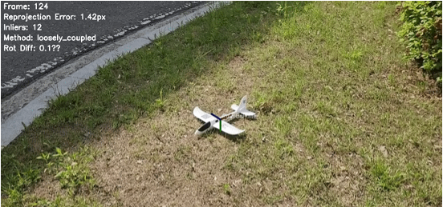
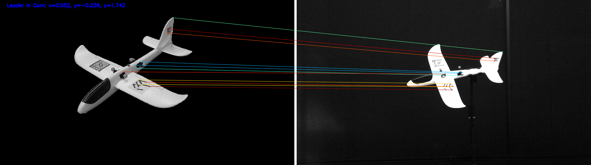
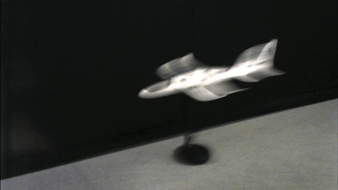

# Viewpoint-Aware Pose Estimation Framework

## Overview

Viewpoint-Aware Pose Estimation Framework is a real-time 6-DOF (6 Degrees of Freedom) pose estimation system designed specifically for aircraft tracking. It combines classical robotics techniques with modern deep learning to achieve robust, low-latency pose estimation with proper handling of vision processing delays.

### Key Features

- 🚁 **Real-time Aircraft Tracking**: Specialized for aircraft pose estimation with 8 viewpoint-specific anchors
- ⏱️ **Timestamp-Aware Processing**: Canonical VIO/SLAM approach for handling vision latency
- 🧠 **Enhanced Unscented Kalman Filter**: Variable-dt prediction with fixed-lag buffer for out-of-sequence measurements
- 🎯 **Multi-threaded Architecture**: Optimized for both low-latency display (30 FPS) and accurate processing
- 🔧 **Physics-Based Filtering**: Rate limiting prevents impossible orientation/position jumps
- 📊 **Adaptive Viewpoint Selection**: Score-based selection across 8 pre-computed viewing angles with reuse optimization

---

## Example Scenarios

Below are sample images illustrating various input conditions the system handles:

| Sample | Description |
|--------|-------------|
|  | **Far-distance Input** — Target aircraft captured from a long range |
|  | **Feature Matching** — Keypoint correspondence between anchor and input |
|  | **Blur / Harsh Condition** — Motion-blurred or degraded input frame |

## Demo Videos

| Video | Description |
|-------|-------------|
| [demo_concept_harsh_condition.mp4](demo_concept_harsh_condition.mp4) | Pose estimation running under harsh visual conditions (blur, lighting changes) |
| [outdoor_simple_test_example.mp4](outdoor_simple_test_example.mp4) | Basic outdoor flight test with real-time pose overlay |

---

## System Architecture

```
┌─────────────────┐    ┌─────────────────┐
│   MainThread    │    │ ProcessingThread │
│   (30 FPS)      │    │   (Variable)     │
│                 │    │                  │
│ • Camera capture│    │ • YOLO detection │
│ • Timestamp     │ ┌──│ • Feature match  │
│ • Visualization │ │  │ • Pose estimation│
│ • UKF prediction│ │  │ • UKF update     │
└─────────────────┘ │  └─────────────────┘
         │           │           │
         └─── Queues + Locks ────┘
                   │
            ┌─────────────┐
            │   Enhanced  │
            │     UKF     │
            │(Timestamp-  │
            │   Aware)    │
            └─────────────┘
```

### Multi-Threading Design

- **MainThread**: High-frequency capture and display (30 FPS) with immediate timestamp recording
- **ProcessingThread**: AI-heavy computation (YOLO + SuperPoint + LightGlue + PnP) with timestamp-aware updates
- **Enhanced UKF**: Handles measurements at correct historical times with variable-dt motion models

---

## Technical Innovation

### Timestamp-Aware Vision Processing

Unlike traditional pose estimation systems that suffer from vision latency, this framework implements the canonical VIO/SLAM approach:

1. **Immediate Timestamp Capture**: `t_capture = time.monotonic()` recorded the moment frames are obtained
2. **Latency-Corrected Updates**: UKF processes measurements at their actual capture time, not processing time
3. **Fixed-Lag Buffer**: 200-frame history enables handling of out-of-sequence measurements
4. **Variable-dt Motion Model**: Adapts to actual time intervals instead of assuming fixed frame rates

### Enhanced Unscented Kalman Filter

**State Vector (16D):**
```python
# [0:3]   - Position (x, y, z)
# [3:6]   - Velocity (vx, vy, vz)  
# [6:9]   - Acceleration (ax, ay, az)
# [9:13]  - Quaternion (qx, qy, qz, qw)
# [13:16] - Angular velocity (wx, wy, wz)
```

**Key Features:**
- **dt-Scaled Process Noise**: `Q_scaled = Q * dt + Q * (dt²) * 0.5`
- **Adaptive Measurement Noise**: `R_adaptive = R_base * (1 + γ * e_reproj / max(n_inlier, 1))`
- **Quaternion Normalization**: Prevents numerical drift
- **Hemisphere Consistency Check**: Flips quaternion sign when dot product with prediction is negative
- **Rate Limiting**: Physics-based constraints (v_max = 1.5 m/s, ω_max = 30°/s)
- **Robust Covariance**: SVD fallback for numerical stability

---

## Computer Vision Pipeline

### 1. Multi-Scale Object Detection
- **YOLOv8n**: Custom trained on aircraft ("iha" class)
- **Adaptive Thresholding**: 0.90 → 0.75 → 0.65 confidence cascade
- **Largest-Box Selection**: Focuses on primary aircraft target

### 2. Deep Feature Extraction & Matching
- **SuperPoint**: CNN-based keypoint detector (up to 1024 keypoints, detection threshold 0.03)
- **LightGlue**: Transformer-based attention feature matching
- **8 Viewpoint Anchors**: Pre-computed reference images covering upper/lower diagonal viewpoints

### 3. Robust Pose Estimation
- **EPnP + RANSAC**: 3000 iterations, 8-pixel reprojection threshold, 95% confidence
- **VVS Refinement**: Virtual Visual Servoing for sub-pixel accuracy
- **Coverage Score**: Entropy-based spatial distribution metric over 4 body-frame regions

### 4. Adaptive Viewpoint Selection (Algorithm 1)
```python
viewpoints = ['NE', 'NW', 'SE', 'SW', 'NE2', 'NW2', 'SE2', 'SW2']
```

Each frame, the system selects the best viewpoint using a weighted score:

```
score = λ₁ · inliers + λ₂ · coverage_score
```

- **Full Evaluation**: All 8 templates are evaluated; the highest-scoring viewpoint is selected
- **Reuse Optimization**: If the selected viewpoint matches the previous one and score > θ_reuse, full evaluation is skipped next frame
- **Automatic Re-evaluation**: When reuse quality drops below θ_reuse, full evaluation resumes immediately

---

## Installation

### Requirements

**Python Version**: 3.8+

**Hardware Requirements**:
- NVIDIA GPU with CUDA support (recommended)
- 8GB+ RAM
- USB camera or video input

### Dependencies

```bash
# Core Dependencies
pip install torch torchvision torchaudio

# Computer Vision & AI
pip install ultralytics>=8.0.0
pip install lightglue
pip install opencv-python>=4.7.0

# Scientific Computing
pip install numpy>=1.24.0
pip install scipy>=1.11.0
```

### Required Files

1. **YOLO Model**: `best.pt` (trained aircraft detection model)
2. **Anchor Images**: 8 viewpoint reference images (NE.png, NW.png, SE.png, SW.png, NE2.png, NW2.png, SE2.png, SW2.png)
3. **Input Video**: Your aircraft footage for processing

---
